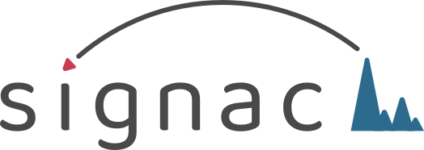

# Signac 

[](https://github.com/stuart-lab/signac/actions)
[](https://cran.r-project.org/package=Signac)
[](https://cran.r-project.org/package=Signac)

## Overview

Signac is a comprehensive R package for the analysis of single-cell
chromatin data. Signac includes functions for quality control,
normalization, dimension reduction, clustering, differential activity,
and more.

Documentation and tutorials can be found at
<https://stuartlab.org/signac/>

## Installation

To install the latest release of Signac from CRAN:

``` r
setRepositories(ind=1:3) # needed to automatically install Bioconductor dependencies
install.packages("Signac")
```

To release the latest develop version from GitHub:

``` r
if (!requireNamespace("remotes", quietly = TRUE))
    install.packages("remotes")
remotes::install_github("stuart-lab/signac", ref = "develop")
```

## Release notes

For a changelog please see the [NEWS
file](https://github.com/stuart-lab/signac/blob/develop/NEWS.md), also
available on the [Signac
website](https://stuartlab.org/signac/news/index.html).

## Contributing

We welcome contributions to the Signac package. Please see the
[contribution guide](https://github.com/stuart-lab/signac/blob/develop/CONTRIBUTING.md)
for more information.

## Getting help

If you encounter a bug or have a feature request, please open an
[issue](https://github.com/stuart-lab/signac/issues).

If you would like to discuss questions related to single-cell analysis,
you can open a
[discussion](https://github.com/stuart-lab/signac/discussions).

## Roadmap

Signac runs on a quarterly release schedule. Additional releases will be 
scheduled in the case of urgent bug fixes. The development roadmap can be viewed
on GitHub [here](https://github.com/orgs/stuart-lab/projects/1).

## Citing Signac

If you use the Signac package in your work please cite [Stuart et
al. 2021](https://doi.org/10.1038/s41592-021-01282-5)

```
@ARTICLE{signac,
  title     = "Single-cell chromatin state analysis with Signac",
  author    = "Stuart, Tim and Srivastava, Avi and Madad, Shaista and Lareau,
               Caleb A and Satija, Rahul",
  journal   = "Nat. Methods",
  publisher = "Nature Publishing Group",
  pages     = "1--9",
  month     =  nov,
  year      =  2021,
  url       = "https://www.nature.com/articles/s41592-021-01282-5",
  language  = "en"
}
```

## Related packages

-   [Seurat](https://github.com/satijalab/seurat)
-   [SeuratObject](https://github.com/satijalab/seurat-object)
-   [SeuratDisk](https://github.com/mojaveazure/seurat-disk)
-   [SeuratData](https://github.com/satijalab/seurat-data)
-   [SeuratWrappers](https://github.com/satijalab/seurat-wrappers)
-   [Azimuth](https://github.com/satijalab/azimuth)
