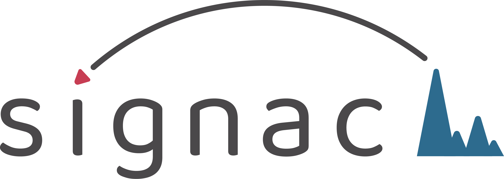

[](https://github.com/stuart-lab/signac/actions)
[](https://cran.r-project.org/package=Signac)
[](https://cran.r-project.org/package=Signac)

# Signac 

Signac is a comprehensive R package for the analysis of single-cell
chromatin data.

## Features

Signac is designed for the analysis of single-cell chromatin data, including scATAC-seq,
single-cell targeted tagmentation methods such as [scCUT&Tag](https://www.nature.com/articles/s41467-019-09982-5)
and [scNTT-seq](https://www.nature.com/articles/s41587-022-01588-5),
and multimodal datasets that jointly measure chromatin state alongside other
modalities.

Signac currently supports the following features:

* Calling peaks
* Quantifying per-cell counts in different genomic regions
* Calculating single-cell QC metrics
* Dimensional reduction, visualization, and clustering
* Identifying cell-type-specific peaks
* Visualizing 'pseudo-bulk' coverage tracks
* Integration of multiple single-cell datasets
* Integration with single-cell RNA-seq datasets
* Sequence motif enrichment analysis
* Transcription factor footprinting analysis
* Linking peaks to correlated genes
* Parallelization through the [future](https://cran.r-project.org/package=future) package
* Seamless interface with [Seurat](https://satijalab.org/seurat), [SeuratWrappers](https://github.com/satijalab/seurat-wrappers), [SeuratDisk](https://github.com/mojaveazure/seurat-disk), and [SeuratData](https://github.com/satijalab/seurat-data) functionality
* Interoperability with [Bioconductor](https://bioconductor.org/) tools

Check out the Signac [vignettes](articles/overview.html) page for in-depth 
tutorials.

## Quick installation

```r
setRepositories(ind=1:3)
install.packages("Signac")
```

For full installation instructions see the [install](articles/install.html) page.

## Getting help

If you encounter a bug or have a feature request, please open an
[issue](https://github.com/stuart-lab/signac/issues).

If you would like to discuss questions related to single-cell analysis,
you can open a
[discussion](https://github.com/stuart-lab/signac/discussions).

## Roadmap

Signac runs on a quarterly release schedule. Additional releases will be 
scheduled in the case of urgent bug fixes. The development roadmap can be viewed
on GitHub [here](https://github.com/orgs/stuart-lab/projects/1).
