# Guided analyses

The following guided analyses demonstrate a standard end-to-end analysis 
pipeline for different types of single-cell chromatin data.

## [Human peripheral blood mononuclear cells](pbmc_vignette.html)

In this tutorial we analyze a human peripheral blood mononuclear cell (PBMC)
dataset of ~7,000 cells.

```{r echo=FALSE, out.height="30%"}
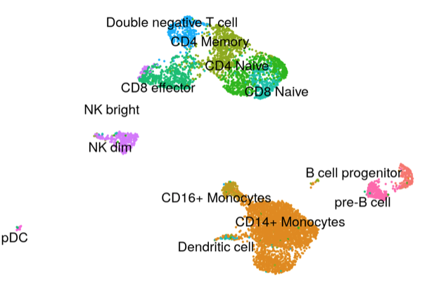
```

## [Mouse cortical brain cells](mouse_brain_vignette.html)

In this tutorial we analyze a dataset of ~3,500 cortical neurons from the adult mouse
brain.

```{r echo=FALSE, out.height="30%"}
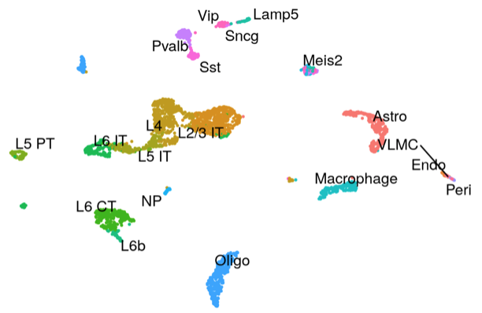
```

## [Joint scRNA-seq and scATAC-seq analysis: 10x Multiomic](pbmc_multiomic.html)

In this tutorial we demonstrate a joint analysis of combined gene expression and
DNA accessibility data, measured in the same human PBMCs using the 10x Genomics
multiomic kit.

```{r echo=FALSE, out.height="30%"}
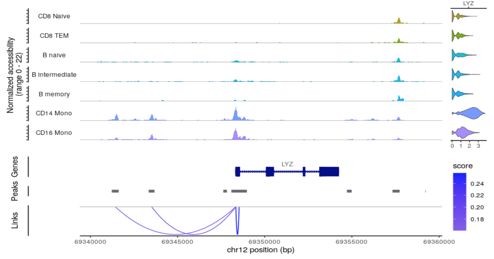
```


## [Joint scRNA-seq and scATAC-seq analysis: SNARE-seq](snareseq.html)

In this tutorial we demonstrate strategies to analyze a SNARE-seq dataset where
we have paired measurements of gene expression and DNA accessibility from the 
same mouse brain nuclei.

```{r echo=FALSE, out.height="30%"}
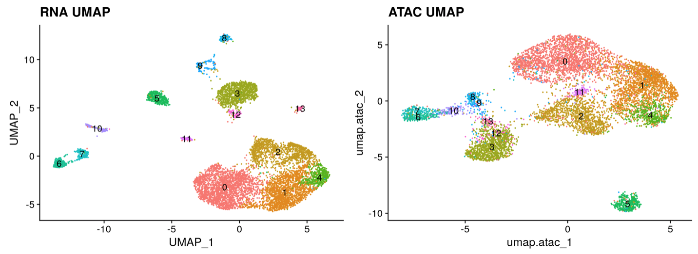
```

## [Joint single-cell mitochondrial DNA genotyping and DNA accessibility analysis](mito.html)

In this tutorial we identify clonotypes using mitochondrial DNA mutations identified
from scATAC-seq data, and jointly analyze clonal cellular relationships and DNA
accessibility patterns in a human colorectal cancer sample.

```{r echo=FALSE, out.width="50%"}
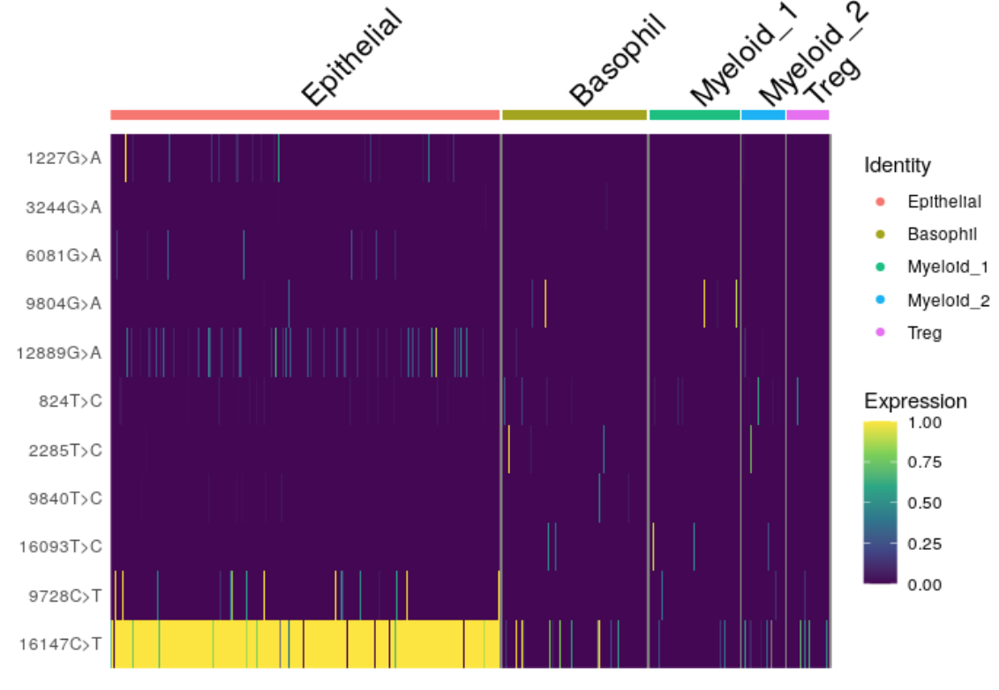
```

# How-to

The following short vignettes demonstrate how to perform more specialized 
analysis tasks.

## [Peak calling](peak_calling.html)

In this vignette we demonstrate how to perform cell-type-specific peak
calling for scATAC-seq data.

```{r echo=FALSE, out.height="50%"}
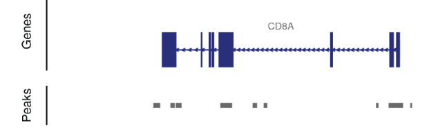
```

## [Merging datasets](merging.html)

This vignette outlines strategies for merging different single-cell chromatin
datasets together.

```{r echo=FALSE, out.width="50%"}
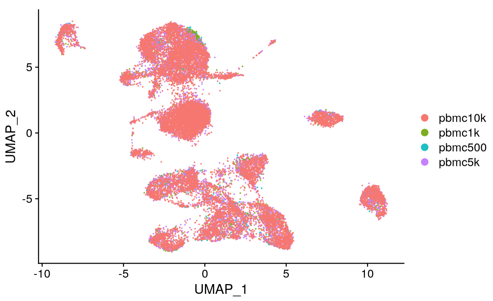
```

## [Integration and label transfer](integrate_atac.html)

Here we demonstrate the integration of multiple single-cell chromatin datasets,
as well as label transfer from a reference dataset to an unlabeled query dataset.

```{r echo=FALSE, out.height="30%"}
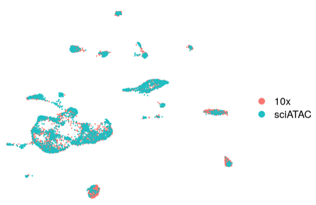
```

## [DNA sequence motif enrichment analysis](motif_vignette.html)

In this vignette we demonstrate how to perform DNA sequence motif enrichment
analysis using Signac.

```{r echo=FALSE, out.height="30%"}
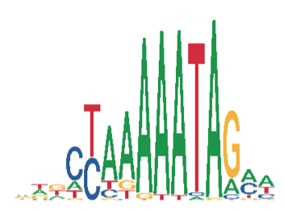
```

## [Transcription factor footprinting analysis](footprint.html)

In this vignette we demonstrate how to perform motif footprinting analysis,
using a human hematopoietic stem cell dataset as an example.

```{r echo=FALSE, out.height="30%"}
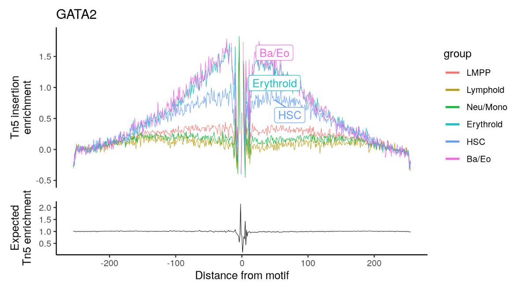
```

## [Building trajectories with Monocle 3](monocle.html)

Here we demonstrate how to build trajectories using scATAC-seq data with the 
Monocle 3 package and conversion functions present in SeuratWrappers.

```{r echo=FALSE, out.height="30%"}
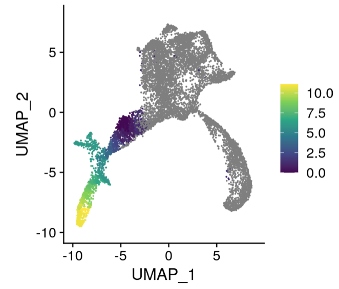
```

## [Finding co-accessible sites with Cicero](cicero.html)

Here we demonstrate how to find co-accessible peaks in scATAC-seq data using the
Cicero package and conversion functions present in SeuratWrappers.

```{r echo=FALSE, out.height="30%"}
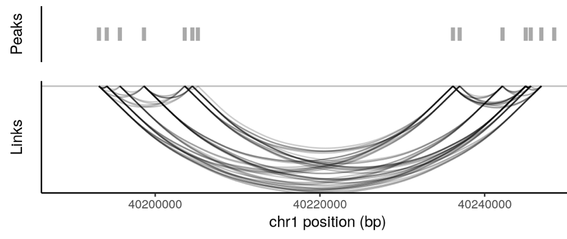
```

## [Data visualization](visualization.html)

Here we demonstrate how to create genome browser-style plots using single-cell
chromatin data.

```{r echo=FALSE, out.height="30%"}
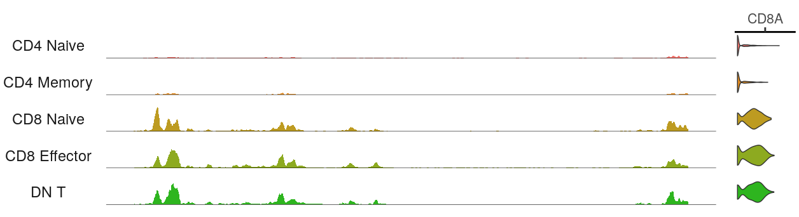
```

# Object interaction

The following vignettes demonstrate how to interact with the Seurat object and 
object classes defined in the Signac package.

## [Data structures and object interaction](data_structures.html)

This vignette details each class defined in Signac, the methods that operate on
each class, and provides some examples of how to interact with these objects to
perform common analysis tasks.

## [Parallel and distributed computing](future.html)

This vignette demonstrates how to enable parallel computing in Signac and Seurat,
and gives an example of the amount of speedup that might be expected from 
enabling parallelization. 
